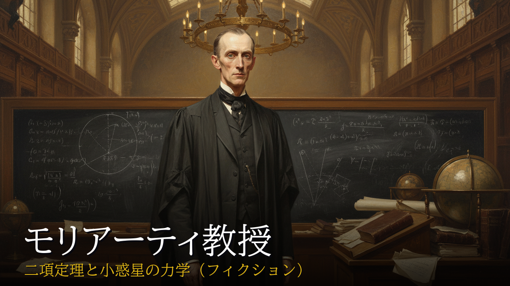

# 数学史記 — 日本語数学史ドキュメンタリー動画 自動生成パイプライン


`episode_config.json` 1 ファイルから 10 ステップを自動実行し、ナレーション・字幕・Manim 数学アニメ・画像・BGM を統合して 10〜19 分の YouTube 完成動画 ([詳細仕様](docs/02_pipeline/VIDEO_SPEC.md)) を生成するパイプライン。
日本語数学史 YouTube チャンネル「[数学史記 (@sugakushiki)](https://youtube.com/@sugakushiki)」の制作基盤として継続運用している。

数学史以外の人物伝記・歴史ドキュメンタリーへの汎用化も想定した設計だが、本リポジトリは「数学史記」プロジェクトの実装をそのまま公開している。


---

## なぜ作ったか / 既存ツールとの違い

数学アニメは [Manim](https://www.manim.community/) が、音声合成は [VOICEVOX](https://voicevox.hiroshiba.jp/) が、動画編集は [FFmpeg](https://ffmpeg.org/) が、それぞれ単機能で優れている。
しかし「企画書 1 枚 → 10 分超の数学史ドキュメンタリー完成動画」を end-to-end で生成する統合パイプラインは存在しなかった。

本プロジェクトは以下を 1 config から駆動する統合実装を提供する。

- **10 ステップの自動実行** — スクリプト生成 (Claude Opus) / 音声合成 (VOICEVOX または Google Cloud TTS) / 字幕 / Wikimedia 画像取得 / 画像生成 (Gemini Flash + Vision QA) / サムネイル / Manim + Ken Burns + route_map + Blender / FFmpeg アセンブリ / YouTube 概要欄 / BGM
- **生成物のライフサイクルに沿った QA** — 欠陥を「最も安く捕まえられる時点」に置く設計。合成前の静的予防 (config 検証 / 事前事実チェック / 読み lint / cliche scanner)、生成直後の実測検出 (複数エージェントの script QA / 画像とナレーションの整合 / STT による読み確認 / 発話速度の実測 / Manim 図の Vision 判定と bbox 衝突検出)、出荷物の検証 (assemble 直前の stale 検出 / 完了後の出力検証 / 出荷 mp4 からの音声再確認)。詳細は [`docs/architecture.md`](docs/architecture.md) §4
- **構造化ログ** — `--log-file` opt-in で全ステップの severity 3 階層 JSONL を取得、step 別工数や失敗箇所が後から jq で集計可能
- **エピソード横断 lint** — 全エピソードを Wikidata Q-id で索引し、表記揺れ (例: `ニルス ↔ ニールス`) を Levenshtein で検出
- **duration-aware Manim** — `timing.json` から各シーンの実音声尺を取得し、アニメ再生時間を自動調整

---

## 主な機能

- **end-to-end 統合**: `episode_config.json` 1 枚から完成 mp4 まで 10 ステップを自動実行 (中断・再開・部分再ビルド対応)
- **多層防御 QA**: 3 層の事前検証 (config / 事前事実 / smoke test) + 多系統 lint (自動: script QA / image QA / Manim 史実整合 / Manim 図の Vision QA と bbox 衝突検出 / route_map 衝突 / サムネイル Vision QA / cliche scanner / 白縁検出 / 肖像参照 gap、手動: 数式変数整合 / cross-ep 用語整合 / 出荷 mp4 の音声再確認) + build 後の構造 verify。**判定が決定論的なガードは中断し、非決定的な判定 (Vision・STT・実測値) は advisory** に留める
- **構造化ログ**: severity 3 階層 (`info` / `warning` / `critical`)、JSON line 形式、`--log-file PATH` opt-in (既定はバイト同一性維持)
- **duration-aware Manim**: 各 Manim テンプレートが `timing.json` から実音声尺を取得し、アニメ再生時間を自動同期
- **TTS エンジン 2 系統**: `episode_config.json` の `tts.engine` で VOICEVOX (ローカル) と Google Cloud TTS (Chirp3-HD) を切替。**両者は API の能力が違うため QA の形も変わる** — VOICEVOX は合成前に kana を実測できるので予防型の読みガード、Cloud は実測できないので合成後の STT で検証し、代わりに文単位の発話速度ゆれを実測して正規化する
- **VOICEVOX 自動辞書登録 + narration_speech 同期**: 数式記号や難読語をルールベースで音声読み替え、ナレーション編集時の drift 検出
- **集積運用された誤読予防**: 数式音声化の誤読パターンを辞書 / N分のM 自動 kana 変換 / pronunciation_check Claude prompt / 字幕 LaTeX sanitize の 4 層で global 集積予防 (per-ep 個別対応に陥らない設計)
- **Wikimedia 自動取得 + Vision QA**: ライセンス検証 + 別人除外キーワード + Claude Sonnet による品質採点
- **YouTube 概要欄自動生成**: チャプター自動算出、BGM・参考文献・画像クレジットを自動統合

---

## アーキテクチャ

4 つの構造的視点 (パイプラインフロー / Manim テンプレート構造 / エピソード config スキーマ / QA + 観測性) を Mermaid 図で詳説:

→ [`docs/architecture.md`](docs/architecture.md)

---

## 必須前提

| 項目 | 想定環境 |
|---|---|
| OS | Windows 11 想定 (Linux/Mac 動作未確認) |
| Python | 3.11.0 |
| FFmpeg | 2026-02 以降推奨 |
| Manim | v0.19.2 (`-qh` で 1080p) |
| VOICEVOX | 0.25.1 (GUI アプリ起動、localhost:50021)。`tts.engine=voicevox` の場合のみ必要 |
| Google Cloud TTS | `tts.engine=cloud` の場合に必要 (`GOOGLE_TTS_API_KEY`)。Chirp3-HD |
| Anthropic Claude Code CLI | スクリプト生成・QA・Vision 評価で使用 |
| Google AI Studio API | Gemini Flash 画像生成、および Cloud 音声の STT 読み確認で使用 (`GOOGLE_API_KEY`) |
| フォント | BIZ UDMincho (リポジトリに同梱、OFL 1.1) |

`GOOGLE_API_KEY` (Gemini) と `GOOGLE_TTS_API_KEY` (音声合成) は**別のキー**。
取り違えると「存在しない API ブロック」を追うことになるので、起動時の preflight が
どちらを見ているか明示する。

セットアップ難易度は中〜高 (Claude Code CLI ログイン必須、voicevox 回は GUI 常駐も必要)。

---

## 既知の制約

- **GPU 不要 / CPU レンダリング前提** — Manim・Blender (Eevee) ともに CPU レンダリングで動作する前提。GPU は不要だが、その分 Manim レンダリングには時間がかかる (1 エピソードの full build で数十分規模)。
- **Blender テンプレートは環境構築の難度が高い** — headless Blender の導入は OS・バージョン依存が大きい。未導入でもパイプラインは動作し、Blender シーンを使わないエピソードは影響を受けない。
- **Windows 想定 / Linux・Mac 未確認** — 開発・動作確認は Windows 11 のみ。パスや `os.system` 経由の Claude CLI 呼び出しなど Windows 固有の実装を含む。
- **VOICEVOX 回は GUI が常時必要** — `tts.engine=voicevox` では localhost:50021 の VOICEVOX エンジン (GUI アプリ) を起動しておく必要がある。`tts.engine=cloud` ならローカルサーバは不要で、代わりに `GOOGLE_TTS_API_KEY` が要る。
- **Claude Code CLI ログインが必要** — スクリプト生成・QA・Vision 評価は Claude Code CLI (`claude -p`) 経由 (公式 SDK ではなく CLI を使う設計、下記「主要な技術判断」参照)。
- **API コスト目安** — 1 エピソードあたり Gemini Flash 画像生成で月 ¥180〜¥240 程度。Claude 側は Anthropic Max 契約の範囲内で運用しており、契約形態によっては別途コストが発生する。

---

## クイックスタート

`examples/moriarty/` のフィクション題材エピソード (約 7 分) は同梱の `episode_config.json` から end-to-end で再現できます (生成物の `output_final.mp4` 約 76 MB はリポジトリに含めません)。下記コマンドで再現:

```bash
# Windows (PowerShell or cmd)
git clone <repo-url> sugakushiki-pipeline
cd sugakushiki-pipeline
python -m venv venv
venv\Scripts\activate
pip install -r requirements.txt

# .env を作成して API キーを設定 (Claude は下の `claude login` の CLI 認証を使うため API キー不要)
echo GOOGLE_API_KEY=AIza... > .env
# tts.engine=cloud のエピソードを作る場合は音声合成用のキーも追加 (Gemini とは別キー)
# echo GOOGLE_TTS_API_KEY=AIza... >> .env

# VOICEVOX GUI を起動 (localhost:50021)。tts.engine=cloud なら不要

# Claude Code CLI ログイン
claude login

# サンプル生成 (examples/moriarty、約 5 〜 8 分の短尺)
python src/pipeline.py examples/moriarty/episode_config.json
```

詳細フラグ (部分再ビルド / QA 制御 / 構造化ログ等) は `python src/pipeline.py --help` を参照。

---

## 主要な技術判断

- **Claude Opus を CLI 経由で呼ぶ**: 公式 Python SDK でなく `claude -p` を `os.system` + 一時ファイル経由で起動 (Windows の `subprocess` での日本語クラッシュ回避、Max 契約内で追加コスト 0)
- **Gemini Flash + Vision QA の組合せ**: 画像生成は Gemini (低コスト)、品質評価は Claude Sonnet (高精度)。Wikimedia 実写写真をリファレンスにした年齢変換生成で人物同一性を担保
- **Manim 1 ファイル 1 クラス**: AST 走査による自動発見と LLM スクリプト生成での選択を成立させるための制約。`construct()` 内 `mode` 分岐でクラス爆発を回避
- **stdout 不変 + stderr 構造化チャンネル**: 既存ビルドのバイト同一性を保ちつつ構造化ログを後付けで導入。マーカー prefix 付き JSONL 行を親プロセスが多重分離
- **副作用ゼロ要素を優先 + 構造拡張は段階導入**: 既存出力に影響しない改善 (lint・smoke test・logger opt-in) を先行して品質基盤を作り、構造拡張は運用フィードバック後に判断する設計原則

---

## サンプル

- **[`examples/moriarty/`](examples/moriarty/README.md)**  — シャーロック・ホームズの登場人物「モリアーティ教授」を架空の数学者として扱う技術デモ用フィクションエピソード (パブリックドメイン題材)。本チャンネルでは公開しない、リポジトリ専用の動作実例。約 7 分 / 約 76 MB / 7 シーン (intro / person × 2 / math × 3 / closing) の `output_final.mp4` を生成。Newton の一般化二項定理 / Cauchy・Abel の収束理論 / Gauss-Newcomb の小惑星軌道計算という 19 世紀の実在の数学を Sherlockian 学術文献の解釈と組み合わせて紹介する内容。詳細は [`examples/moriarty/README.md`](examples/moriarty/README.md) 参照
- **公開動画** — チャンネル [@sugakushiki](https://youtube.com/@sugakushiki) を参照

---

## プロジェクト現状

- 制作運用: 定期的に新エピソードを制作・公開中 (実績はチャンネル参照)
- 開発: 品質強化 / リファクタリングを継続、新機能は運用フィードバックを待ってから段階導入

---

## リポジトリ構造

```
sugakushiki/
├── src/                          # コード本体
│   ├── pipeline.py               # オーケストレーター (10 ステップ + 多層防御)
│   ├── pipeline_log.py           # 構造化ロガー (stderr チャンネル方式)
│   ├── claude_backend.py         # Claude Code CLI 呼び出しラッパー
│   ├── pipeline_progress.py      # ステップ進捗の記録・再開判定
│   ├── script_generator.py       # スクリプト生成 (Claude Opus via CLI)
│   ├── audio_generator.py        # VOICEVOX + 辞書 + 発音チェック
│   ├── cloud_tts.py              # Google Cloud TTS (Chirp3-HD) + SSML 読み固定
│   ├── subtitle_generator.py     # SRT + drawtext filter_script 生成
│   ├── wikimedia_fetcher.py      # Wikimedia Commons 画像取得 + ライセンス検証
│   ├── image_generator.py        # Gemini Flash + Vision QA + リファレンス生成
│   ├── image_watermark_trim.py   # ChatGPT/Sora 透かし除去 + 1920x1080 リサイズ
│   ├── visual_generator.py       # Ken Burns + Manim + route_map + Blender
│   ├── blender_renderer.py       # Blender headless レンダリング (Eevee CPU)
│   ├── video_assembler.py        # FFmpeg 3 段アセンブリ
│   ├── credits_generator.py      # YouTube 概要欄 + チャプター + クレジット
│   ├── bgm_mixer.py              # BGM ミックス + 冒頭ポーズ + 末尾フェード
│   ├── thumbnail_generator.py    # YouTube サムネイル生成 (3 パターン)
│   ├── qa_checker.py             # QA Gate 1 (複数エージェント)
│   ├── qa_retry.py               # QA リトライ + 比較ゲート
│   ├── qa_image_checker.py       # QA Gate 2 (画像-ナレーション整合性)
│   ├── qa_manim_consistency.py   # Manim 史実整合 lint
│   ├── qa_thumbnail_vision.py    # サムネイルの Vision QA (識別性判定)
│   ├── qa_formula_variable_consistency.py  # 数式表示と Manim 変数の整合 lint
│   ├── pre_script_fact_check.py  # 事前事実チェック (Claude + 算術 + Wikidata)
│   ├── cliche_scanner.py         # 時代物 stereotype 予防検出
│   ├── cliche_dictionary.json    # cliche_scanner 用辞書
│   ├── config_validator.py       # episode_config スキーマ検証
│   ├── check_font_coverage.py    # 字幕フォント文字対応事前検証 (fonttools)
│   ├── math_render.py            # matplotlib mathtext 共有ユーティリティ
│   ├── sympy_helper.py           # SymPy 記号計算ヘルパー
│   ├── voicevox_dict.json        # VOICEVOX ユーザー辞書
│   ├── manim_templates/          # Manim テンプレート (1 ファイル 1 クラス)
│   └── blender_templates/        # Blender テンプレート
├── docs/                         # 仕様書・規約・落とし穴集
│   ├── architecture.md           # 4 Mermaid 図でアーキテクチャ俯瞰
│   ├── INDEX.md                  # docs 全体目次
│   ├── 01_concept/               # コンセプト・ロードマップ
│   ├── 02_pipeline/              # episode_config / scene 仕様
│   ├── 03_quality/               # スタイルガイド / QA / 落とし穴
│   └── 04_assets/                # 画像生成 / アセット規約
├── scripts/                      # 補助スクリプト (開発・検証ツール)
│   ├── smoke_test.py             # パイプライン前の静的健全性検査
│   ├── quick_baseline_check.py   # 出力ベースライン照合
│   ├── post_build_verify.py      # build 後の構造 verify (8 check)
│   ├── manim_preview_modes.py    # Manim テンプレ全 mode の preview render
│   ├── add_endcard_bgm.py        # 汎用 mp4 エンドカード BGM 付与
│   │
│   │  # 読み・音声 (pipeline が自動起動)
│   ├── reading_guard.py          # VOICEVOX: kana 実測で誤読を合成前に検出
│   ├── gen_cloud_readings.py     # Cloud: narration_speech_cloud を生成
│   ├── cloud_reading_lint.py     # Cloud: 多読み漢字 / 難語 / 間 / 生分数の静的 lint
│   ├── stt_qa.py                 # Cloud: 合成 wav を Gemini STT で読み確認
│   ├── cloud_speed_qa.py         # Cloud: 発話速度の段差検出 + atempo 正規化
│   ├── verify_shipped_audio.py   # 出荷 mp4 から切り出して STT 再確認 (on-demand)
│   │
│   │  # 画像・映像 (pipeline が自動起動)
│   ├── lint_portrait_reference.py   # 主題肖像が実写参照を使えているか
│   ├── portrait_prompt_lint.py      # 肖像 prompt と参照写真の Vision 整合 lint
│   ├── lint_image_borders.py        # 焼き込まれた白縁・白帯をピクセル実測
│   ├── manim_vision_qa.py           # Manim 図の意味・美観を Vision 判定
│   ├── manim_text_collision_qa.py   # Manim の文字 bbox 衝突を決定論検出
│   │
│   │  # 横断 lint (手動)
│   ├── lint_cross_episode_terms.py     # エピソード横断の用語表記揺れ検出
│   ├── lint_video_spec.py              # 動画仕様 (VIDEO_SPEC) の SSOT lint
│   ├── lint_template_hardcoded_claims.py  # 再利用テンプレの題材 hardcode 監査
│   └── lint_tower_exponent.py          # 指数タワーの曖昧な散文表記を検出
├── examples/                     # 動作実例
│   └── moriarty/                 # 技術デモ用フィクションエピソード (config/scene_def/QA/description/thumbnails。mp4 等の生成物は非同梱)
├── .claude/
│   └── rules/                    # path-scoped rules (4 本: episode-config / manim-development / qa-workflows / image-generation)
├── requirements.txt              # 完全 lock file (pip freeze 出力)
├── requirements.in               # top-level 直接依存 10 件
├── requirements-dev.txt          # 開発依存 (ruff)
├── pyproject.toml                # ruff config (将来 build config 拡張余地)
├── .python-version               # 3.11.0
├── _font.ttc                     # BIZ UDMincho (OFL 1.1)
├── LICENSE                       # MIT
└── LICENSES/
    └── OFL.txt                   # SIL Open Font License 1.1 (同梱)
```

---

## 貢献

本リポジトリは個人プロジェクトの公開実装です。**Pull Request・機能要望は受け付けていません** (制作運用に集中するため)。MIT License なので Fork して自由に改造・転用してください。
バグ報告は GitHub Issue で受け付けています (Issue Template を利用、確認はしますが対応時期の保証はありません)。

→ [`CONTRIBUTING.md`](CONTRIBUTING.md)

---

## ライセンス

- **本体コード・ドキュメント**: MIT License (Copyright © 2026 sugakushiki) — [`LICENSE`](LICENSE) 参照
- **フォント (`_font.ttc`)**: BIZ UDMincho、SIL Open Font License Version 1.1 — [`LICENSES/OFL.txt`](LICENSES/OFL.txt) を同梱
- **音楽 (BGM)**: YouTube Audio Library 楽曲を本リポジトリには同梱せず、`episode_config.json` で URL のみ指定する運用 (利用は YouTube Audio Library の許諾範囲)
- **画像**: Wikimedia Commons から取得した画像はパイプライン生成物に紐づくため本リポジトリには含めない (各動画の概要欄および `wikimedia_credits.json` でクレジット記載)

---

## Acknowledgments

- [Manim Community](https://www.manim.community/) — 数学アニメーションの中核
- [VOICEVOX](https://voicevox.hiroshiba.jp/) — 日本語音声合成 (青山龍星、ID:13)
- [Wikimedia Commons](https://commons.wikimedia.org/) — 公開ドメイン肖像画・写真
- [Anthropic Claude](https://www.anthropic.com/) — スクリプト生成・QA・Vision 評価
- [Google Gemini](https://ai.google.dev/) — 画像生成 (Gemini Flash)
- [BIZ UDMincho Project Authors / Morisawa Inc.](https://github.com/morisawa/biz-udgothic) — 日本語フォント
- 「モリアーティ教授」(Sir Arthur Conan Doyle『シャーロック・ホームズ』シリーズ、パブリックドメイン) — `examples/moriarty/` の題材
