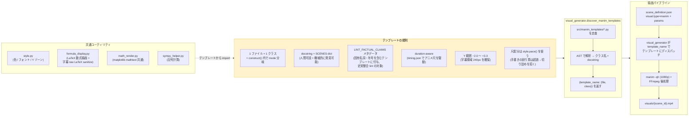
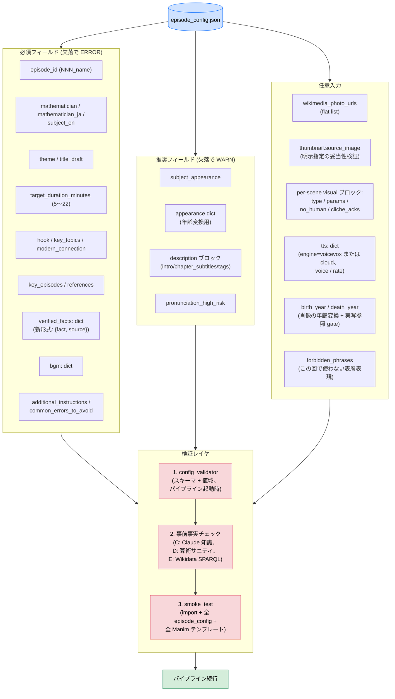
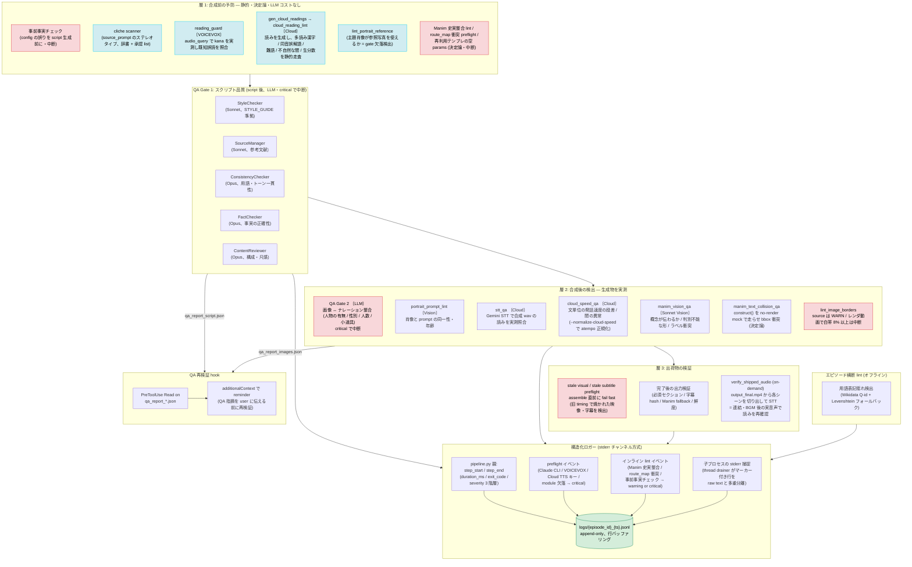

# 数学史記 — アーキテクチャ

> 日本語数学史ドキュメンタリー動画制作パイプライン。
> `episode_config.json` → 10 ステップ生成 → `output_final.mp4` (10〜19 分、仕様: [docs/02_pipeline/VIDEO_SPEC.md](02_pipeline/VIDEO_SPEC.md))。
>
> 本書はコードベースを読むために必要な 4 つの構造的視点を扱う:
> パイプラインフロー、Manim テンプレート構造、エピソード config スキーマ、
> QA + 観測性レイヤ。詳細な実行時挙動はモジュール docstring および
> `docs/02_pipeline/` / `docs/03_quality/` 配下の文書を参照。

---

## 1. パイプラインフロー

`episode_config.json` 1 ファイルから 10 ステップに分岐して生成が進む。各ステップは
エピソードディレクトリにアーティファクトを書き出し、後続ステップが消費する。
防御チェックは生成物のライフサイクルに沿って走る: スクリプト生成**前**の事前事実チェック、
スクリプトと映像の**間**の Manim lint + route_map preflight、アセンブリ**直前**の
stale 検出、パイプライン**完了後**の出力検証 (詳細は §4)。

音声合成は 2 つのエンジンを選べる (`episode_config.json` の `tts.engine`)。
**VOICEVOX** はローカルサーバで合成し `audio_query` から kana を実測できるため
読みを合成前に検証できる。**Cloud TTS (Chirp3-HD)** は kana を返す口が無いため、
読みの検証を合成後の STT に回し、代わりに文単位の発話速度ゆれという
別の問題に対処する必要がある。この非対称性がステップ 2 前後の分岐を生む。

```mermaid
flowchart TB
    cfg[("episode_config.json")]:::inputArtifact

    subgraph preflight["preflight (fail fast)"]
        direction TB
        pf1["Python モジュール /<br/>Claude CLI 認証 /<br/>VOICEVOX サーバ 〔voicevox〕 /<br/>Cloud TTS・STT キー 〔cloud〕"]:::guard
    end

    cfg --> preflight
    preflight --> validate[["config_validator<br/>(スキーマ + 値域)"]]:::guard
    validate --> b17[["事前事実チェック<br/>(Claude Sonnet + 算術 + Wikidata)"]]:::guard
    b17 --> step1

    subgraph pipeline["10 ステップ生成"]
        direction TB
        step1["1. script_generator<br/>(Claude Opus を CLI 経由)"]:::step
        step2["2. audio_generator<br/>〔voicevox〕辞書 + kana 実測 + 発音チェック<br/>〔cloud〕Chirp3-HD + SSML phoneme 読み固定"]:::step
        step3["3. subtitle_generator<br/>(SRT + drawtext + timing 署名)"]:::step
        step4["4. wikimedia_fetcher<br/>(ライセンス + EXCLUDE_KEYWORDS)"]:::step
        step5["5. image_generator<br/>(Gemini Flash + Vision QA + no_human フラグ)"]:::step
        step5b["6. thumbnail_generator<br/>(3 パターン + source_image 妥当性検証 + Vision QA)"]:::step
        step6["7. visual_generator<br/>(Ken Burns + Manim + route_map + Blender)"]:::step
        step7["8. video_assembler<br/>(FFmpeg 3 段アセンブリ)"]:::step
        step8["9. credits_generator<br/>(YouTube 概要欄 + チャプター)"]:::step
        step9["10. bgm_mixer<br/>(冒頭ポーズ + BGM + 末尾フェード)"]:::step

        step1 -- "scene_definition.json" --> qa1[["QA Gate 1<br/>(5 エージェント、Sonnet/Opus)"]]:::guard
        qa1 --> pre2[["合成前の読み検証<br/>〔voicevox〕reading_guard<br/>〔cloud〕gen_cloud_readings → cloud_reading_lint"]]:::guard
        pre2 --> step2
        step2 -- "audio/*.wav + timing.json" --> post2[["合成後の音声検証 〔cloud〕<br/>cloud_speed_qa (速度・間) / stt_qa (読み)<br/>--normalize-cloud-speed で atempo 正規化"]]:::guard
        post2 --> step3
        step3 -- "subtitles.srt + drawtext.txt" --> step4
        step4 -- "images/wiki_*.jpg + credits.json" --> step5
        step5 -- "images/*.png" --> qa2[["QA Gate 2<br/>(画像とナレーションの整合性)"]]:::guard
        qa2 --> step5b
        step5b -- "thumbnails/A,B,C.png" --> b10
        b10[["Manim 史実整合 lint<br/>(多 mode の mode 未指定 / 再利用テンプレの空 params)"]]:::guard --> b11
        b11[["route_map 衝突 preflight"]]:::guard --> step6
        step6 -- "visuals/*.mp4" --> post6[["描画後の検証<br/>manim_vision_qa / manim_text_collision_qa /<br/>白帯検出 (8% 以上は中断)"]]:::guard
        post6 --> stale[["stale 検出 (assemble 直前・fail fast)<br/>旧 timing で焼かれた映像・字幕"]]:::guard
        stale --> step7
        step7 -- "output_assembled.mp4" --> step8
        step8 -- "description.txt" --> step9
    end

    step9 -- "output_assembled.mp4 →<br/>(atomic rename)" --> outFinal[("output_final.mp4")]:::outputArtifact
    outFinal --> verify[["完了後の出力検証<br/>(ファイル存在 + 必須セクション +<br/>Manim fallback / 字幕 hash / 鮮度)"]]:::guard

    classDef inputArtifact fill:#cfe2ff,stroke:#0d6efd,color:#000
    classDef outputArtifact fill:#d4edda,stroke:#198754,color:#000
    classDef step fill:#fff3cd,stroke:#ffc107,color:#000
    classDef guard fill:#f8d7da,stroke:#dc3545,color:#000
```

### この階層化の理由

- **アトミックリネーム**: `output_final.mp4` はパイプライン全体が完了したときだけ
  出現する。以前はアセンブリ段階と BGM 段階が同じファイル名を使い回していたため、
  途中失敗しても古いファイルが残り、成功完了したビルドと区別がつかなかった。
- **多層防御**: 各チェックは「その欠陥を最も安く捕まえられる時点」に置く。事前事実
  チェックは config レベルの誤りを、10 分から数十分かかるスクリプト生成が
  走り出す前に止める。
  QA Gate 1 はスクリプト品質問題を音声合成前に、QA Gate 2 は画像とナレーションの
  不整合を画像生成後に捕捉する。Manim 史実整合 lint と route_map 衝突 preflight は
  描画前に、白帯検出と文字衝突検出は描画後に働く。層の全体像は §4 を参照。
- **アセンブリ直前の stale 検出**: 音声の読みや速度を変更すると `timing.json` が
  刷新されるが、既に焼かれた映像 mp4 と字幕 SRT は旧尺のまま残る。個々の
  アーティファクトは正常に見えるため、突き合わせでしか検出できない。連結してから
  気付くと再描画のやり直しになるので、assemble 直前に fail fast させる。
- **エンジンで分岐する読み検証**: VOICEVOX は合成前に kana を実測できるので予防型
  (`reading_guard`)、Cloud TTS は実測できないので検出型 (合成後の STT) になる。
  同じ「読み間違い」という欠陥に対し、エンジンの API 能力の差がチェックの
  位置を決めている。
- **サブプロセス分離**: 各ステップは子プロセスとして起動する。`stdout` は
  そのままコンソールに継承され、`stderr` のみ親が捕捉してマーカー prefix の
  ある JSONL イベントを構造化ログ経路に多重分離する。

---

## 2. Manim テンプレート構造

Manim は数学図解アニメーションの主ツール。
テンプレート探索・lint・描画レイヤが一貫して動くよう、テンプレートは
厳格な形に従う。

### この制約の理由

- **1 ファイル 1 クラス**: `discover_manim_templates` は AST 走査で最初に
  見つけた 1 クラスを返す。複数クラスのファイルは黙ってテンプレートを取りこぼす。
- **`construct()` 内 mode 分岐**: `mode` パラメータで 1 クラスが複数バリアントを
  描画できる (例: `polynomial_roots` の `cubic_factoring` / `quintic_complex` /
  `s3_permutations`)。クラス爆発を回避する。
- **`SCENES` dict**: スクリプト生成 LLM は各テンプレートの docstring と
  `SCENES` を読んで visual を選ぶ。これがないと LLM が存在しないテンプレート名を
  生成しうる。
- **`LINT_FACTUAL_CLAIMS`**: 画面上の固有名詞・年号のうち事実に基づくもの
  (例: "1850 ガロア / Galois") を宣言する。装飾的ラベルを誤検出せずに
  ナレーションと相互チェック可能になる。
- **字幕ゾーン**: 字幕は Manim シーンでは下端から 240px (Ken Burns では 160px)
  に配置する。テンプレートはこのラインより上を保つ必要がある。座標の静的 lint
  (合成前) と bbox 衝突検出・Vision QA (描画後) の多層で確認する。
- **`style.pace()`**: アニメの尺配分は `per = 本体尺 / 数値` と手書きしてはいけない。
  分母が `run_time` 係数の総和より小さいと、アニメの合計が割り当て尺を超過し、
  mp4 が音声尺に合わせて切り詰められて**結論部分が消える**。`pace()` は
  `per = 予算 / sum(weights)` を保証してこれを構造的に防ぐ。尺が縮むのではなく
  末尾が失われる形で壊れるため、尺の一致を見る stale 検出では捕まらない。

テンプレートは [`src/manim_templates/`](../src/manim_templates/) に配置。
各ファイルの docstring が mode と適用エピソードを説明する。

---

## 3. エピソード config スキーマ

`episode_config.json` がパイプライン唯一の宣言的入力。
高コストな処理が走る前に 3 層で検証される。

### 検証を 3 層に分けた理由

- **`config_validator`** はスキーマ形状の誤り (フィールド欠落・型違反・
  値域違反) を捕捉する。低コスト (~100 ms) で起動時に走る。
- **事前事実チェック**は `verified_facts` と `key_episodes` の*内容*の誤り
  (誤った生年・職業・事件年) を、10 分から数十分かかるスクリプト生成が
  走り出す前に捕捉する。
  過去の運用で fact warning による手戻りに長時間かかった経験から導入された。
- **smoke test** は別プロセスで動く検証で、大規模リファクタの前に
  オペレータが走らせる。パイプライン実行時まで顕在化しない breakage
  (import エラー / テンプレートファイル欠落 / 全 episodes/ 配下の
  `episode_config.json` の不正) を捕捉する。

`tts.engine` と `birth_year` は任意フィールドだが、**欠落が黙って挙動を変える**
点で他と性質が違う。`tts.engine` 未指定は VOICEVOX として扱われ、Cloud を
意図していた場合は読み調整の系統ごと別物になる。`birth_year` 欠落は実写参照の
gate を閉じ、肖像が全て text-only 生成に落ちる — エラーは出ず、出来上がった顔が
別人になって初めて分かる。後方互換のため既定値を持つフィールドほど、
欠落時に何が起きるかを明示しておく必要がある。

フィールドの意味: [`docs/02_pipeline/EPISODE_CONFIG_TEMPLATE.md`](02_pipeline/EPISODE_CONFIG_TEMPLATE.md) 参照。

---

## 4. QA + 観測性

QA は 2 つの LLM Gate と、**生成物のライフサイクルに沿った 3 層**で構成する。
層を分ける原理は「**その欠陥を最も安く捕まえられる時点はどこか**」。合成前に
静的に分かるものは合成前に、合成しないと分からないものは合成直後に、
連結・BGM を経た最終形でしか分からないものは出荷物で捕まえる。
構造化ロガーは `--log-file` 指定時にこれらの結果を 1 つの append-only
JSONL ストリームに多重分離する。

〔VOICEVOX〕〔Cloud〕はそのエンジンでのみ走ることを示す (§1 step 2 を参照)。
明記のないものは両エンジン共通。

### この配置の理由

- **層 1 が最も価値が高い**: 合成前に静的に分かる欠陥を、高コストな生成
  (スクリプト生成、Gemini 画像、TTS 合成、Manim 描画) の**前**に落とす。
  事前事実チェックは不正な config をスクリプト生成が走り出す前に止め、
  cliche scanner は `source_prompt` のステレオタイプが画像に焼き付く前に捕まえ、
  読み lint は誤読を合成前に洗う。この層は辞書・正規表現・AST ベースで
  決定的、LLM コストがかからない。
- **層 2 は「合成しないと分からないもの」だけを担う**: 実際にどう読まれたか
  (STT)、実際にどんな速度で喋ったか、実際に描画したフレームで図が読めるか。
  ここは原理的に事前検出できないので、生成直後に実測する。
- **層 3 は「最終形でしか分からないもの」**: 速度正規化や読み修正で音声尺が
  変わると、字幕タイムスタンプと映像尺が旧尺のまま取り残される。これは
  個々のアーティファクトを見ても分からず、assemble 直前の突き合わせで初めて
  分かるため fail fast にしてある。`verify_shipped_audio` が
  **連結・BGM 後の実音声**を STT するのも同じ理由で、合成直後の wav では
  出荷物の実態を保証できない。
- **中断するかは「決定論か否か」で分かれる**: 判定が非決定的なもの (STT の
  書き起こし、Vision の意味判定、速度の実測値) は**すべて advisory**。誤検出に
  引きずられて正しい出力を壊すほうが損失が大きいので、人間が判断する。
  一方、判定が決定論的な構造ガード (config スキーマ、テンプレの必須 params、
  route_map の bbox 衝突、白帯の画素比、timing 署名の不一致) は**中断する** —
  誤検出がほぼ無く、かつ見逃すと後段で修正できないため。各ガードには
  `--allow-*` の escape があり、意図的に進める場合だけ明示的に外す。
- **LLM QA Gate は critical で止まる**: Gate 1 / Gate 2 と事前事実チェックは
  判定が非決定的にもかかわらず中断する。上の原則の例外に見えるが、これらが
  捕まえるのは**内容の誤り** (事実誤認・画像とナレーションの不整合) で、
  出荷後に発見しても動画を作り直すしかない。誤検出のコストより見逃しのコストが
  高いので既定を「止まる」にし、`--qa-allow-warn` /
  `--fact-check-allow-warn` で設計判断として受け入れられるようにしてある。
- **決定論と LLM の二重化**: Manim 図は `manim_text_collision_qa` (bbox の
  決定論的衝突検出) と `manim_vision_qa` (Sonnet Vision の意味・美観判定) の
  両方で見る。前者は「重なっている」を見逃さないが「独楽が独楽に見えない」は
  分からず、後者はその逆で微小な重なりを見落とす。
- **QA 再検証 hook**: QA レポートは構造化されているため (severity / citation /
  confidence) 一見権威的に見える。hook は `additionalContext` 経由で
  reminder を差し込み、アシスタントが QA 出力を鵜呑みにせず各指摘を
  ソースに照らして再検証してから user に伝える運用にする。
- **構造化ロガーの stderr チャンネル方式**: stdout は触らない (パススルー
  維持、Manim/FFmpeg の進捗バー保護、出力のビット同一性確保)。構造化イベントは
  すべて stderr に専用マーカー prefix で乗せ、親プロセスがバックグラウンド
  thread で構造化イベントと raw stderr text を多重分離する (deadlock 回避)。
  既定は `--log-file PATH` opt-in なので既存ビルドはバイト単位で同一に保たれる。
- **エピソード横断 lint はオフライン**: `lint_cross_episode_terms.py` は
  新エピソード追加後に手動実行する。全エピソードを横断して Wikidata Q-id
  インデックスを構築し、表記揺れ (例: 同一人物に対する `ニルス ↔ ニールス`)
  を Levenshtein で報告する。

QA エージェントの詳細プロンプト: [`docs/03_quality/QA_PIPELINE.md`](03_quality/QA_PIPELINE.md) 参照。
過去の落とし穴一覧: [`docs/03_quality/pitfalls.md`](03_quality/pitfalls.md) 参照。

---

## 関連ドキュメント

- [`docs/INDEX.md`](INDEX.md) — docs 全体目次 (用途別 + カテゴリ別)
- [`docs/02_pipeline/EPISODE_CONFIG_TEMPLATE.md`](02_pipeline/EPISODE_CONFIG_TEMPLATE.md) — episode_config の完全スキーマ仕様
- [`docs/02_pipeline/SCENE_SPEC.md`](02_pipeline/SCENE_SPEC.md) — Manim シーン仕様
- [`docs/03_quality/STYLE_GUIDE.md`](03_quality/STYLE_GUIDE.md) — トーン / VOICEVOX / Manim / ビジュアル / 出典ルール
- [`docs/03_quality/QA_PIPELINE.md`](03_quality/QA_PIPELINE.md) — QA エージェントの設計詳細
- [`docs/03_quality/pitfalls.md`](03_quality/pitfalls.md) — 過去の落とし穴 (カテゴリ別整理)
- [`docs/04_assets/IMAGE_GUIDE.md`](04_assets/IMAGE_GUIDE.md) — 画像生成プロンプト設計
