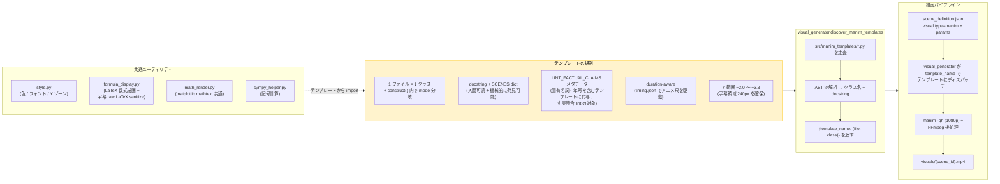
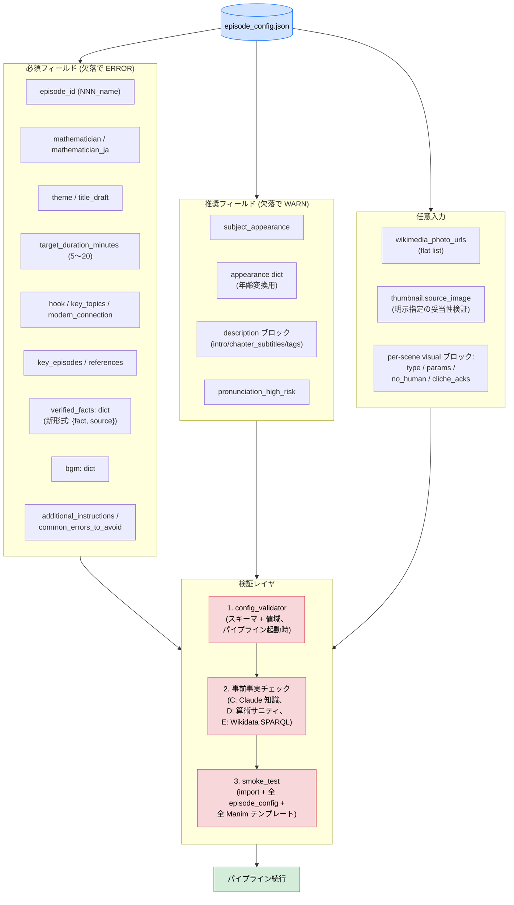
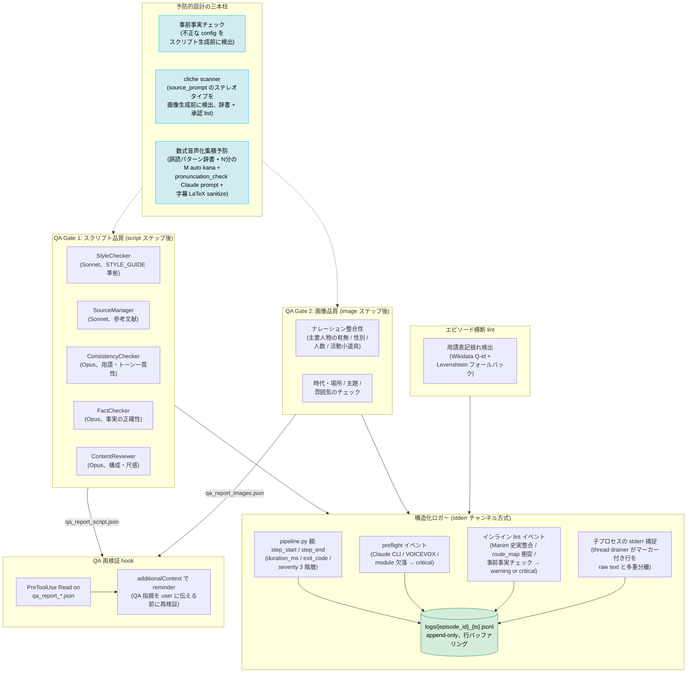

# 数学史記 — アーキテクチャ

> 日本語数学史ドキュメンタリー動画制作パイプライン。
> `episode_config.json` → 9 ステップ生成 → `output_final.mp4` (10〜19 分、仕様: [docs/02_pipeline/VIDEO_SPEC.md](02_pipeline/VIDEO_SPEC.md))。
>
> 本書はコードベースを読むために必要な 4 つの構造的視点を扱う:
> パイプラインフロー、Manim テンプレート構造、エピソード config スキーマ、
> QA + 観測性レイヤ。詳細な実行時挙動はモジュール docstring および
> `docs/02_pipeline/` / `docs/03_quality/` 配下の文書を参照。

---

## 1. パイプラインフロー

`episode_config.json` 1 ファイルから 9 ステップに分岐して生成が進む。各ステップは
エピソードディレクトリにアーティファクトを書き出し、後続ステップが消費する。
防御チェックは 3 箇所で走る: スクリプト生成**前**の事前事実チェック、スクリプトと映像の**間**の
Manim lint + route_map preflight、パイプライン**完了後**の出力検証。

```mermaid
flowchart TB
    cfg[("episode_config.json")]:::inputArtifact

    subgraph preflight["preflight (fail fast)"]
        direction TB
        pf1["Python モジュール /<br/>Claude CLI 認証 /<br/>VOICEVOX サーバ"]:::guard
    end

    cfg --> preflight
    preflight --> validate[["config_validator<br/>(スキーマ + 値域)"]]:::guard
    validate --> b17[["事前事実チェック<br/>(Claude Sonnet + 算術 + Wikidata)"]]:::guard
    b17 --> step1

    subgraph pipeline["9 ステップ生成 (+ thumbnail サブステップ)"]
        direction TB
        step1["1. script_generator<br/>(Claude Opus を CLI 経由)"]:::step
        step2["2. audio_generator<br/>(VOICEVOX + 辞書 + 発音チェック)"]:::step
        step3["3. subtitle_generator<br/>(SRT + drawtext)"]:::step
        step4["4. wikimedia_fetcher<br/>(ライセンス + EXCLUDE_KEYWORDS)"]:::step
        step5["5. image_generator<br/>(Gemini Flash + Vision QA + no_human フラグ)"]:::step
        step5b["5.5 thumbnail_generator<br/>(3 パターン + source_image 妥当性検証 + Vision QA)"]:::step
        step6["6. visual_generator<br/>(Ken Burns + Manim + route_map + Blender)"]:::step
        step7["7. video_assembler<br/>(FFmpeg 3 段アセンブリ)"]:::step
        step8["8. credits_generator<br/>(YouTube 概要欄 + チャプター)"]:::step
        step9["9. bgm_mixer<br/>(冒頭ポーズ + BGM + 末尾フェード)"]:::step

        step1 -- "scene_definition.json" --> qa1[["QA Gate 1<br/>(5 エージェント、Sonnet/Opus)"]]:::guard
        qa1 --> step2
        step2 -- "audio/*.wav + timing.json" --> step3
        step3 -- "subtitles.srt + drawtext.txt" --> step4
        step4 -- "images/wiki_*.jpg + credits.json" --> step5
        step5 -- "images/*.png" --> qa2[["QA Gate 2<br/>(画像とナレーションの整合性)"]]:::guard
        qa2 --> step5b
        step5b -- "thumbnails/A,B,C.png" --> b10
        b10[["Manim 史実整合 lint"]]:::guard --> b11
        b11[["route_map 衝突 preflight"]]:::guard --> step6
        step6 -- "visuals/*.mp4" --> step7
        step7 -- "output_assembled.mp4" --> step8
        step8 -- "description.txt" --> step9
    end

    step9 -- "output_assembled.mp4 →<br/>(atomic rename)" --> outFinal[("output_final.mp4")]:::outputArtifact
    outFinal --> verify[["完了後の出力検証<br/>(ファイル存在 + 必須セクション +<br/>Manim fallback / 字幕 hash / 鮮度)"]]:::guard

    classDef inputArtifact fill:#cfe2ff,stroke:#0d6efd,color:#000
    classDef outputArtifact fill:#d4edda,stroke:#198754,color:#000
    classDef step fill:#fff3cd,stroke:#ffc107,color:#000
    classDef guard fill:#f8d7da,stroke:#dc3545,color:#000
```

### この階層化の理由

- **アトミックリネーム**: `output_final.mp4` はパイプライン全体が完了したときだけ
  出現する。以前はアセンブリ段階と BGM 段階が同じファイル名を使い回していたため、
  途中失敗しても古いファイルが残り、成功完了したビルドと区別がつかなかった。
- **多層防御**: 事前事実チェック (config レベルの誤りを検出) は 23 分のスクリプト
  生成が走り出す前に止める。QA Gate 1 はスクリプト品質問題を音声合成前に捕捉する。
  QA Gate 2 はナレーションと画像の不整合を画像生成後に捕捉する。Manim 史実整合
  lint は描画前に固有名詞・年号のずれを捕捉する。route_map 衝突 preflight は
  描画前に bbox の重なりを捕捉する。完了後の出力検証で最終成果物を確認する。
- **サブプロセス分離**: 各ステップは子プロセスとして起動する。`stdout` は
  そのままコンソールに継承され、`stderr` のみ親が捕捉してマーカー prefix の
  ある JSONL イベントを構造化ログ経路に多重分離する。

---

## 2. Manim テンプレート構造

Manim は数学図解アニメーションの主ツール。
テンプレート探索・lint・描画レイヤが一貫して動くよう、テンプレートは
厳格な形に従う。

### この制約の理由

- **1 ファイル 1 クラス**: `discover_manim_templates` は AST 走査で最初に
  見つけた 1 クラスを返す。複数クラスのファイルは黙ってテンプレートを取りこぼす。
- **`construct()` 内 mode 分岐**: `mode` パラメータで 1 クラスが複数バリアントを
  描画できる (例: `polynomial_roots` の `cubic_factoring` / `quintic_complex` /
  `s3_permutations`)。クラス爆発を回避する。
- **`SCENES` dict**: スクリプト生成 LLM は各テンプレートの docstring と
  `SCENES` を読んで visual を選ぶ。これがないと LLM が存在しないテンプレート名を
  生成しうる。
- **`LINT_FACTUAL_CLAIMS`**: 画面上の固有名詞・年号のうち事実に基づくもの
  (例: "1850 ガロア / Galois") を宣言する。装飾的ラベルを誤検出せずに
  ナレーションと相互チェック可能になる。
- **字幕ゾーン**: 字幕は Manim シーンでは下端から 240px (Ken Burns では 160px)
  に配置する。テンプレートはこのラインより上を保つ必要がある。

テンプレートは [`src/manim_templates/`](../src/manim_templates/) に配置。
各ファイルの docstring が mode と適用エピソードを説明する。

---

## 3. エピソード config スキーマ

`episode_config.json` がパイプライン唯一の宣言的入力。
高コストな処理が走る前に 3 層で検証される。

### 検証を 3 層に分けた理由

- **`config_validator`** はスキーマ形状の誤り (フィールド欠落・型違反・
  値域違反) を捕捉する。低コスト (~100 ms) で起動時に走る。
- **事前事実チェック**は `verified_facts` と `key_episodes` の*内容*の誤り
  (誤った生年・職業・事件年) を、23 分のスクリプト生成が走り出す前に捕捉する。
  過去の運用で fact warning による手戻りに長時間かかった経験から導入された。
- **smoke test** は別プロセスで動く検証で、大規模リファクタの前に
  オペレータが走らせる。パイプライン実行時まで顕在化しない breakage
  (import エラー / テンプレートファイル欠落 / 全 episodes/ 配下の
  `episode_config.json` の不正) を捕捉する。

フィールドの意味: [`docs/02_pipeline/EPISODE_CONFIG_TEMPLATE.md`](02_pipeline/EPISODE_CONFIG_TEMPLATE.md) 参照。

---

## 4. QA + 観測性

パイプラインは 2 つの QA Gate と複数のインライン lint を走らせる。
構造化ロガーは `--log-file` 指定時にこれらの結果を 1 つの append-only
JSONL ストリームに多重分離する。

### この配置の理由

- **予防的設計の三本柱**: 事前事実チェックは不正な config を*スクリプト生成前*に
  捕捉する (23 分の生成時間を無駄にしない)。cliche scanner は
  `source_prompt` 内のステレオタイプ表現を Gemini Flash が画像に焼き付ける*前*に
  捕捉する。数式音声化集積予防は VOICEVOX 誤読パターンを音声合成前 (script
  生成 prompt + pronunciation_check) と字幕生成前 (formula_display sanitize) に
  捕捉し、per-ep 個別対応を不要にする。3 者とも低コスト (辞書ベース層は決定的、
  LLM コストなし) で、人間レビューでしか出てこない誤りを前倒しで検出する。
- **QA 再検証 hook**: QA レポートは構造化されているため (severity / citation /
  confidence) 一見権威的に見える。hook は `additionalContext` 経由で
  reminder を差し込み、アシスタントが QA 出力を鵜呑みにせず各指摘を
  ソースに照らして再検証してから user に伝える運用にする。
- **構造化ロガーの stderr チャンネル方式**: stdout は触らない (パススルー
  維持、Manim/FFmpeg の進捗バー保護、出力のビット同一性確保)。構造化イベントは
  すべて stderr に専用マーカー prefix で乗せ、親プロセスがバックグラウンド
  thread で構造化イベントと raw stderr text を多重分離する (deadlock 回避)。
  既定は `--log-file PATH` opt-in なので既存ビルドはバイト単位で同一に保たれる。
- **エピソード横断 lint はオフライン**: `lint_cross_episode_terms.py` は
  新エピソード追加後に手動実行する。全エピソードを横断して Wikidata Q-id
  インデックスを構築し、表記揺れ (例: 同一人物に対する `ニルス ↔ ニールス`)
  を Levenshtein で報告する。

QA エージェントの詳細プロンプト: [`docs/03_quality/QA_PIPELINE.md`](03_quality/QA_PIPELINE.md) 参照。
過去の落とし穴一覧: [`docs/03_quality/pitfalls.md`](03_quality/pitfalls.md) 参照。

---

## 関連ドキュメント

- [`docs/INDEX.md`](INDEX.md) — docs 全体目次 (用途別 + カテゴリ別)
- [`docs/02_pipeline/EPISODE_CONFIG_TEMPLATE.md`](02_pipeline/EPISODE_CONFIG_TEMPLATE.md) — episode_config の完全スキーマ仕様
- [`docs/02_pipeline/SCENE_SPEC.md`](02_pipeline/SCENE_SPEC.md) — Manim シーン仕様
- [`docs/03_quality/STYLE_GUIDE.md`](03_quality/STYLE_GUIDE.md) — トーン / VOICEVOX / Manim / ビジュアル / 出典ルール
- [`docs/03_quality/QA_PIPELINE.md`](03_quality/QA_PIPELINE.md) — QA エージェントの設計詳細
- [`docs/03_quality/pitfalls.md`](03_quality/pitfalls.md) — 過去の落とし穴 (カテゴリ別整理)
- [`docs/04_assets/IMAGE_GUIDE.md`](04_assets/IMAGE_GUIDE.md) — 画像生成プロンプト設計
